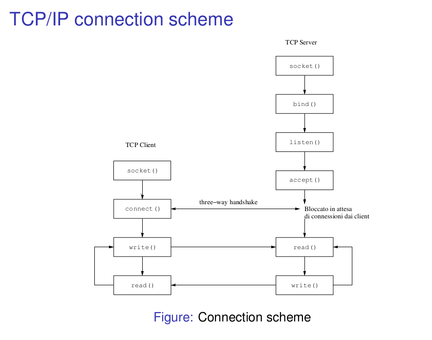

##Socket数据接收程序

###新手入门
1. 安装Linux系统，打开**terminal**，输入 
```
ssh root@121.43.109.2
``` 

2. 登录阿里云服务器后，进入服务器的**/usr/share/nginx/html/**文件夹，该文件夹是**WEB**服务的根目录
，例如你访问**http://121.43.109.2/test.html**，其实就是通过服务器上的**Nginx**获取这个根
目录下面的test.html这个文件并把它发回给你的浏览器，你的浏览器会读取**html**文件的内容并
把内容展示出来
3. **WEB**服务器的根目录下面存放的着每个台区的网页文件，例如**zoneYiwu**目录，类型包括html、
css、javascript和php，其中html和css用于页面的内容和布局控制，javascript用于页面动态事件的处理，
例如鼠标点击事件，php用于从MySQL数据库获取相应的请求数据，并以json格式返回，主要是在WEB页面(html文件)
的Ajax请求中调用它
4. 进入正题，前面说的是数据显示部分，就是把数据从数据库读出来，本Repo主要介绍的是如何将数据存储到
MySQL数据库中，每个台区文件夹下都有一个SocketReceiver文件夹，下面存放了这个程序，在最新的更新中，
该程序存放在SocketReceiver/message_queue/C这个文件夹下，本文中以[这个最新的](./socket_receiver_v02.c)
为准，在后面的程序介绍中会主要介绍程序的主要功能和实现，我们使用的是System V IPC，而不是POSIX IPC

###程序介绍
1. [Socket通信程序](./socket_receiver_v02.c)主要功能是和集中器的GPRS模块连接，接收集中器发来的数据并
存储到MySQL数据库，同时接受WEB页面端发来的查询命令，并将命令发送给集中器，等待数据到达，把收到的数据
存储到MySQL数据库，WEB页面调用的PHP脚本就会将这个查询到的数据从MySQL数据库中读取出来返回到WEB页面上显示
出来
2. 程序主要包括知识点有socket、pthread(线程)、mysql c api、IPC(shared memory、semaphore、message queue)
3. 其中socket主要用来监听集中器GPRS连接请求，在建立连接后保持和集中器的通信，socket建立链接的过程见下图

集中器的GPRS其实就是图中的TCP client，而本Repo中的Socket通信程序其实就是图中的TCP server，集中器的GPRS
已经在硬件中固化了client端的程序，所以我们只要关心server端了，从图上可以看到server端要经历socket、bind、
listen、accept、read/write这几个流程，程序中也是按照这个流程来的，这里就不一一介绍了，值得注意的是我们
在程序中修改了tcp的keepalive机制的一些参数，保证集中器在和服务器断开连接后在短时间内就关闭socket连接，
keepalive机制详见**<<TCP/IP详解 卷1:协议>>**or自行搜索
4. 在程序接受了集中器的连接后，会调用pthread_create新建2个(pthread)线程，分别用于发送数据给集中器
(sendDate_handler函数)和接收集中器的数据(connection_handler函数)
5. 在数据接收线程中，一旦接收到有效数据，就调用restore_data函数将接收到的数据利用mysql c api存储到MySQL
数据库中
6. 最后还剩下IPC(inter-process communication)了，由于网页页面是由Nginx管理，和本程序不是同一个程序，需要
利用进程间通信(IPC)在本程序和Nginx之间传递数据，由于获取数据一般是调用php脚本，所一实际上是在php程序和
本程序间进行IPC。主要用到的IPC有共享内存(shared memory)、消息队列(message queue)和信号量(semaphore)，其中
共享内存用于存储当前数据传递的状态，消息队列用于传递数据，信号量控制同时不能有多个线程访问共享内存，防止
产生竞争条件，所以在开发过程中我们需要了解c语言和php中如何使用这三种IPC方法，[文档目录](./reference)下有
一些参考文档，另外，本文最后一节参考文档给出了一些链接介绍这些

###如何使用
1. 通过make执行[Makefile](./Makefile)
2. 输入下面的命令运行生成的可执行文件(test)，后面的"&"表示程序在后台运行，关闭当前termianl对程序的
运行没有影响
```
./test &
```

###其他
* 服务器端已经安装了Nginx、PHP5、php-fpm和MySQL软件，均可通过sudo apt-get install software-name
获取，装好之后需要在Nginx的配置文件中配置php相关的部分，服务器的[配置文件](./configs/nginx.conf)可供参考
，装好之后可以在**/usr/share/nginx/html/**新建html和php文件，然后通过浏览器访问之，如果能显示出来就说明
安装配置成功了，在这个安装和配置过程中你也许会碰到一些问题，请Baidu/Google之
* 如果你想将服务器上的文件夹(文件的话去掉-r选项)拷贝到自己电脑，可以使用如下命令将文件或者文件夹
拷贝到当前目录下，前提还是**Linux**系统下
```
scp -r root@121.43.109.2:path-of-file-you-want-to-copy .
```
* 实际使用过程中服务器可能运行了多个台区的Socket数据通信程序，且其可执行文件的名字相同，可以用ps命令找出
这些程序的进程号，并用pwdx命令找出进程号对应的目录，进而区分不同台区的Socket程序，如果程序改动了，你就
可以先把对应的进程kill掉，然后重新编译，再后台运行之即可

###参考文档
* [Makefile教程](http://ricostacruz.com/cheatsheets/makefile.html)
* [PHP IPC 函数介绍(包括信号量semaphore、共享内存shared_memory和消息队列message_quue)](http://php.net/manual/en/book.sem.php)
* [C 语言 Message Queue(消息队列)用法介绍](http://beej.us/guide/bgipc/output/html/multipage/mq.html)
